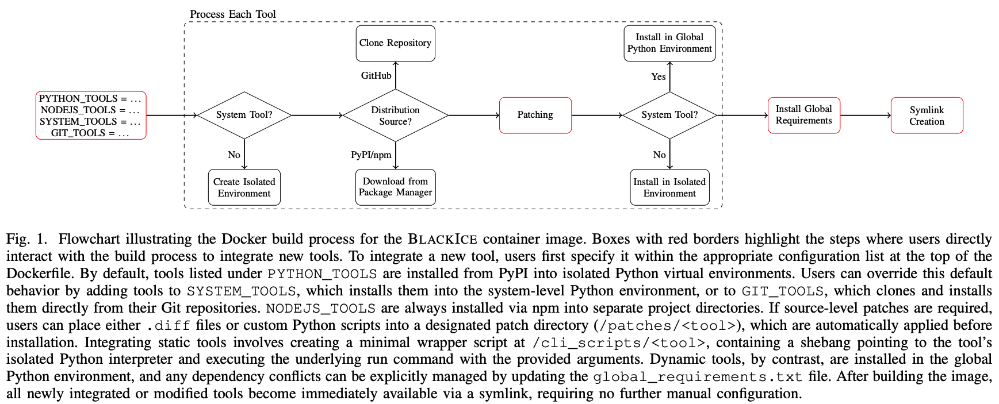

# Dockerfile Design and Setup Guide


## 1. Dockerfile Structure

The Dockerfile follows a clear and structured process, matching the provided flowchart:

- **Determine Installation Type (Isolated vs. Global)**  
  - Static tools are installed into isolated Python virtual environments.
  - Dynamic tools are typically installed globally into the system Python environment.

- **Determine Distribution Source (PyPI/npm or GitHub)**  
  - Tools specified in `GIT_TOOLS` are cloned directly from Git repositories using pinned commit hashes or tags.
  - Other tools listed in `PYTHON_TOOLS` or `NODEJS_TOOLS` are installed directly via PyPI/npm with explicit version pinning.

- **Apply Patches**  
  - Patches are applied automatically to modify or extend the source code prior to installation (details below).

- **Install Tools**  
  - Tools are installed after source retrieval and patch application steps.

- **Global Requirements**  
  - If the `SYSTEM_TOOLS` are modified, users should update `global_requirements.txt` to resolve any potential dependency conflicts.

- **CLI Integration**  
  - Symlinks are automatically created from CLI scripts located in `/cli_scripts/<tool>`, making each tool accessible through the unified command-line interface (details below).  


## 2. Adding Tools or Modifying Versions

Tools included in BlackIce are defined explicitly through clearly structured lists in the Dockerfile. Users can easily integrate new tools or update existing ones by modifying these lists:

- `PYTHON_TOOLS`: Includes all Python-based tools. Unless specified otherwise, tools are installed from PyPI into isolated Python virtual environments. Versions should always be explicitly pinned.
  
- `GIT_TOOLS`: A subset of `PYTHON_TOOLS`, specifying tools that should be installed directly from Git repositories. Each entry follows the format: `TOOL_NAME=GIT_URL=GIT_REF[=REQUIREMENTS_FILE]`
  - `TOOL_NAME`: Matches the tool's Python virtual environment.
  - `GIT_URL`: Repository URL.
  - `GIT_REF`: Specific commit hash, tag, or branch to checkout.
  - `REQUIREMENTS_FILE` *(optional)*: Path relative to repo root (e.g., `requirements.txt`). If omitted, defaults to the repository's `pyproject.toml`.

- `SYSTEM_TOOLS`: A subset of `PYTHON_TOOLS` installed globally into the system-level Python environment. Typically reserved for dynamic tools that have minimal dependency conflicts.

- `NODEJS_TOOLS`: JavaScript/TypeScript-based tools installed via npm into their own separate project directories.

- `CUSTOM_TOOLS`: Self-contained CLI scripts integrated directly into the unified command-line interface without additional dependencies.

Example configuration snippet:
```dockerfile
ARG PYTHON_TOOLS="rigging==3.0.2 garak==0.12.0 giskard[llm]==2.17.0 pyrit cyberseceval"
ARG GIT_TOOLS="pyrit[gcg]=https://github.com/Azure/PyRIT.git=v0.9.0 cyberseceval=https://github.com/meta-llama/PurpleLlama.git=ef5a774=CybersecurityBenchmarks/requirements.txt"
ARG SYSTEM_TOOLS="pyrit rigging"
ARG NODEJS_TOOLS="promptfoo==0.115.1"
ARG CUSTOM_TOOLS="biasforge"
```

Additionally, special tool lists handle tools requiring specific logic, such as Torch dependencies (`TOOLS_WITH_TORCH_DEP`) or legacy dependencies (`TOOLS_WITH_LEGACY_DEPS`).

## 3. Patching Source Code

BlackIce provides an easy mechanism for modifying or customizing tool source code prior to installation. To apply modifications, place source-level patches (`.diff` files) or custom Python files (`.py` files) into the directory: `/patches/<tool>`.  
- Each file should include the relative path to the target file within the tool’s source tree.  
- For tools installed via **Git**, this path must include the root directory of the cloned repository (e.g., `PyRIT/pyrit/prompt_target/__init__.py`).  
- For tools installed via **PyPI**, the path should start directly from the package’s internal structure (e.g., `judges/base.py`).
- If you are adding a new file, include its path as a single-line comment beginning with `# NEW_FILE_PATH` at the top of the file (e.g., `# NEW_FILE_PATH: PyRIT/pyrit/prompt_target/databricks_chat_target.py`).

These patches are applied automatically by the Dockerfile build process just before the tools' installation step.

## 4. Adding CLI Functionality

To ensure that tools are accessible via the unified command-line interface, each tool must have an associated CLI script placed in `/cli_scripts/<tool>`.

- For tools installed via **PyPI** that already provide native CLI functionality, this typically involves creating a minimal wrapper script. The script should point directly to the tool’s isolated Python interpreter and forward any user-provided arguments (see `/cli_scripts/garak` for a minimal example).

- For tools installed via **Git**, the wrapper script should explicitly use the tool’s dedicated Python interpreter (e.g., `#!/venvs/lm-eval-harness/bin/python3`) and invoke the appropriate Python command to execute the tool (see `/cli_scripts/lm-eval-harness` for an example).

Once the script is added and the Docker image is rebuilt, a symlink is automatically created from the script to `/usr/local/bin/<tool>`, making the tool directly executable from the command line.

Additionally, you can add fully custom, self-contained CLI scripts to extend BlackIce with bespoke functionality (such as the example provided by the `biasforge` tool).

## 5. Testing

Testing is performed using `pytest` with test scripts stored in the `tests/` directory. If you built the Docker image yourself, you can run the tests using the following command:

```bash
docker run --rm \
  --platform=linux/amd64 \
  -v "$(pwd)/tests:/tests" \
  -w /tests \
  blackice:latest \
  pytest -v /tests
```

The test suite can also be easily extended to cover any additional tools you include.

# GPU-enabled BlackIce

By default, BlackIce is designed to remain as lightweight as possible, which means limiting `torch` installations to their `+cpu` variants. For most LLM-focused tools, this is sufficient since models are typically hosted externally and accessed through model APIs rather than run directly inside the container. Because `pip` can resolve `torch` dependencies to a CUDA build during installation, each tool that depends on `torch` includes a constraints file in `torch_constraints/{TOOL_NAME}.txt` that pins the CPU-only version explicitly. To enable GPU support for a specific tool, edit that file to specify the appropriate CUDA build.

